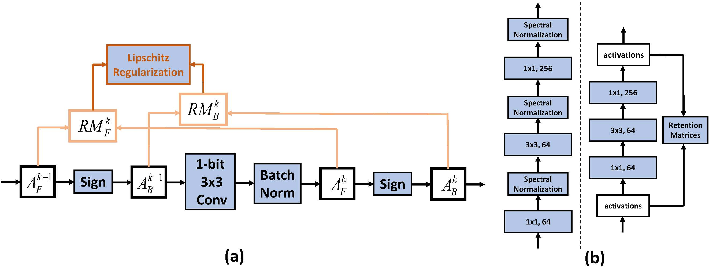

# LCR-BNN: Lipschitz Continuity Retained Binary Neural Network
The code for the Lipschitz Continuity Retained Binary Neural Network, which has been accepted to ECCV 2022.
    
(**a**) An overview of our Lipschitz regularization for a binary convolutional layer: regularizing the BNN via aligning the Lipschitz constants of binary network and its latent full-precision counterpart is the goal of our work. To reach this goal, the input and output activations of the $k$-th layer compose the Retention Matrix ($\mathbf{RM}^k$) for approximating the Lipschitz constant of this layer. $\mathbf{RM}^k_F$ and $\mathbf{RM}^k_B$ are then used to calculate the Lipschitz constant of this layer (the validation of this approximation is elaborated in Section 3.2). Finally, the Lipschitz continuity of the BNN is retained under a regularization module. (**b**) Difference between Spectral Normalization (Left) and LCR (Right).

## Quick Start
First, download our repo:
```bash
git clone https://github.com/42Shawn/LCR_BNN.git
cd LCR_BNN
```
Then, run our repo:
```bash
python main.py --save='v0' --data_path='path-to-dataset' --gpus='gpu-id' --alpha=3.2
```
Note that the alpha can be change to conduct ablation studies, and alpha=0 is equal to RBNN itself.

# Reference
If you find our code useful for your research, please cite our paper.
```
@inproceedings{
shang2022lcr,
title={Lipschitz Continuity Retained Binary Neural Network},
author={Yuzhang Shang and Dan Xu and Bin Duan and Ziliang Zong and Liqiang Nie and Yan Yan},
booktitle={ECCV},
year={2022}
}
```

**Related Work**    
Our repo is modified based on the Pytorch implementation of Rotated Binary Neural Network (RBNN, NeurIPS 2020). Thanks to the authors for releasing their codebase!
